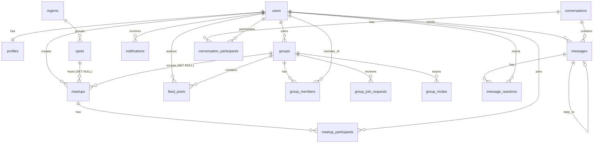

# Datenmodell FlightMeet

Diese Datei ist die **alleinige, verbindliche Schema-Quelle** für FlightMeet und die Basis für alle CI4-Migrations. Sie konsolidiert die teils widersprüchlichen Tabellenvorschläge der Domänen-Dossiers zu **einem** widerspruchsfreien Schema. Wo sich Vorschläge widersprachen, gewinnt die in [`DECISIONS.md`](DECISIONS.md) festgelegte ADR-Entscheidung.

**Engine / Charset:** Alle Tabellen `ENGINE=InnoDB`, `DEFAULT CHARSET=utf8mb4`, `COLLATE=utf8mb4_unicode_ci` (Foreign Keys, Transaktionen, Emoji-Support für Chat/Reaktionen). DB-Name: `db_team15`.

**Globale Konventionen (für ALLE Tabellen gültig, unten nicht je Spalte wiederholt):**
- **IDs:** `BIGINT UNSIGNED AUTO_INCREMENT PRIMARY KEY` als `id`, außer bei den Shield-Tabellen (deren PK-Typen Shield vorgibt) und reinen 1:1-Erweiterungstabellen (siehe `profiles`).
- **FK-Typ (`userref`):** Spalten, die auf `users.id` zeigen, sind `BIGINT UNSIGNED` (ADR-012/A1: die Shield-`users`-Migration wird auf `BIGINT UNSIGNED` überschrieben, sodass das **gesamte** Schema einheitlich BIGINT ist). Alle anderen FKs `BIGINT UNSIGNED`.
- **Zeitstempel:** `created_at TIMESTAMP NULL DEFAULT CURRENT_TIMESTAMP` und – wo Datensätze mutierbar sind – `updated_at TIMESTAMP NULL DEFAULT CURRENT_TIMESTAMP ON UPDATE CURRENT_TIMESTAMP`. (CI4 setzt diese Felder i.d.R. selbst; DB-Defaults als Sicherheitsnetz.)
- **Soft-Delete:** `deleted_at TIMESTAMP NULL DEFAULT NULL` überall dort, wo Inhalte moderierbar/löschbar sind (ADR-008/009); zusätzlich `deleted_by` wo der Löschende auditierbar sein muss.
- **Enum-Konvention (Querschnitt + ADR):** DB speichert **englische, neutrale Keys**; nutzersichtbare **deutsche Labels** liegen im Frontend. Jede Enum-Tabelle unten listet Key → Label.
- **Realtime:** Kein WebSocket, kein zweiter Datenspeicher (ADR-001). Alle „Live"-Felder werden per Polling über dieselben Tabellen gelesen. Keine separaten Realtime-Spalten nötig.

> **✅ Entschieden (ADR-012/A1):** `users.id` ist durchgängig **`BIGINT UNSIGNED`**. Da CodeIgniter Shield `users.id` standardmäßig als `INT UNSIGNED` anlegt, wird die Shield-`users`-Migration **überschrieben** (Spaltentyp → `BIGINT UNSIGNED AUTO_INCREMENT`), **bevor** abhängige Tabellen migriert werden. Der Platzhaltertyp **`userref`** im restlichen Dokument bedeutet damit überall `BIGINT UNSIGNED`.

---

## 1) ER-Überblick

### 1.1 Beziehungsliste (Kurzform)

```
users (Shield) ─1:1─ profiles
users ─1:n─ auth_identities / auth_logins / … (Shield-intern)
users ─n:m─ groups            via group_members
users ─n:m─ meetups           via meetup_participants
users ─n:m─ conversations     via conversation_participants
users ─1:n─ meetups (creator), groups (owner), messages (sender),
            feed_posts (author), notifications (recipient)

spots ─1:n─ meetups            (meetups.spot_id, ON DELETE SET NULL)
regions ─1:n─ spots            (OPTIONAL – siehe §4.4)

meetups ─1:n─ meetup_participants   (ON DELETE CASCADE)
meetups ─0/1:1─ conversations       (polymorph: context_type='meetup', context_id=meetups.id)
meetups ─n:1─ groups                (meetups.group_id NULLABLE, ON DELETE SET NULL)

groups ─1:n─ group_members          (ON DELETE CASCADE)
groups ─1:n─ group_join_requests    (ON DELETE CASCADE)
groups ─1:n─ group_invites          (ON DELETE CASCADE)
groups ─1:n─ feed_posts             (ON DELETE CASCADE)
groups ─1:n─ conversations          (polymorph: context_type='group', context_id=groups.id;
                                      die group_channels = conversations type='group_channel')

conversations ─1:n─ conversation_participants  (ON DELETE CASCADE)
conversations ─1:n─ messages                   (ON DELETE CASCADE)
messages ─1:n─ message_reactions               (ON DELETE CASCADE)
messages ─0/1:1─ messages (reply_to_id, self-ref, ON DELETE SET NULL)

notifications ─n:1─ users (recipient + optional actor)
```

### 1.2 Mermaid erDiagram



> **Polymorphe Kante (kein harter FK):** `conversations.context_type`/`context_id` zeigt je nach `type` auf `meetups.id` oder `groups.id`. Diese Kante ist im Diagramm bewusst NICHT als FK modelliert (siehe §6).

---

## 2) Shield-Tabellen (NICHT neu erfinden — nur referenzieren)

Authentifizierung läuft über **CodeIgniter Shield** (ADR-004). Die folgenden Tabellen werden durch die Shield-Migrationen (`vendor/codeigniter4/shield`) angelegt und **dürfen nicht von Hand redefiniert** werden. Sie sind hier nur dokumentiert, damit FK-Referenzen verständlich sind.

| Tabelle | Zweck (durch Shield verwaltet) |
|---|---|
| `users` | Identitäts-Kern: `id`, `username` (nullable, UNIQUE), `status`, `status_message`, `active`, `last_active`, `created_at`, `updated_at`, `deleted_at`. **E-Mail & Passwort liegen NICHT hier**, sondern in `auth_identities`. |
| `auth_identities` | Login-Identitäten (email_password, magic-link, …): enthält `secret` (= E-Mail), `secret2` (= Passwort-Hash). UNIQUE(`type`,`secret`). |
| `auth_logins` | Login-Versuche (Audit, Throttling). |
| `auth_token_logins` | Login-Versuche per Access-Token (für API-Token, hier i.d.R. ungenutzt – Session-Auth). |
| `auth_remember_tokens` | „Remember-me"-Tokens. |
| `auth_groups_users` | Zuordnung User → Shield-Group (Plattform-Rolle `user`/`admin`, ADR-004). |
| `auth_permissions_users` | Direkte Permissions je User (optional). |

**Plattform-Rollen** werden über Shield-Groups (`auth_groups_users`) abgebildet — es gibt **keine** eigene `role`-Spalte auf einer App-Tabelle. Gruppen mind.: `user`, `admin`. Admin-Vergabe per Seed/SQL.

### 2.1 Vorbereitete (deferred) Auth-Spalten — Schema vorhalten, NICHT implementieren

E-Mail-Verifikation und Passwort-Reset sind **nicht im MVP** (ADR-008), das Schema wird aber vorbereitet:

- **`email_verified_at`** (E-Mail-Verifikation): Shield modelliert „verifiziert" über `auth_identities` (z.B. einen `email_activate`-Identity-Eintrag bzw. `users.active`). Eine zusätzliche, **vorbereitete** Spalte wird auf `profiles` geführt: `email_verified_at TIMESTAMP NULL DEFAULT NULL` — Default `NULL` (= unverifiziert/„nicht erzwungen"). Bleibt im MVP ungenutzt.
- **`password_resets`** (Passwort-Reset): als **vorbereitete, im MVP leere** Tabelle dokumentiert (§3.3). Wird nicht migriert ausgeliefert, solange kein SMTP bestätigt ist; Definition steht bereit zum Nachrüsten.

---

## 3) Domänen-Tabellen: Auth-Erweiterung & Profil

### 3.1 `profiles` — Pilotenprofil (1:1 zu Shield-`users`, ADR-010)

| Spalte | Typ | Null | Default | Bemerkung |
|---|---|---|---|---|
| `user_id` | `userref` | NOT NULL | — | **PK = FK** → `users.id` (echtes 1:1) |
| `display_name` | `VARCHAR(80)` | NOT NULL | — | Anzeigename; einziges Pflichtfeld beim Setup |
| `handle` | `VARCHAR(40)` | NOT NULL | — | eindeutiger @-Name; UNIQUE; **Pflicht** (Nutzer werden darüber gefunden) |
| `bio_markdown` | `TEXT` | NULL | NULL | **Rohtext** (eingeschränktes Markdown, ADR-011); Sanitizing beim Rendern |
| `avatar_path` | `VARCHAR(255)` | NULL | NULL | relativer Pfad in `public/media/uploads/avatars/` |
| `experience_level` | `ENUM('beginner','advanced','expert')` | NULL | NULL | gleiche Skala wie meetups (siehe §3.1.1) |
| `license_class` | `VARCHAR(60)` | NULL | NULL | Schein/Lizenz als **Freitext** (ADR-012/C1; nationale Klassen variieren), z.B. „A-Schein", „B-Schein" |
| `glider` | `VARCHAR(120)` | NULL | NULL | Marke/Modell, Freitext |
| `home_region` | `VARCHAR(80)` | NULL | NULL | Freitext-Heimatregion |
| ~~`home_spot_id`~~ | — | — | — | **nicht umgesetzt** (nie migriert): Freitext-`home_region` deckt den Bedarf, und der exakte Heimat-Startplatz war als sensibel markiert (W8) |
| `flight_hours` | `INT UNSIGNED` | NULL | NULL | geschätzte Flugstunden |
| `email_verified_at` | `TIMESTAMP` | NULL | NULL | **vorbereitet/deferred** (ADR-008), MVP ungenutzt |
| `created_at` | `TIMESTAMP` | NULL | `CURRENT_TIMESTAMP` | |
| `updated_at` | `TIMESTAMP` | NULL | `CURRENT_TIMESTAMP ON UPDATE` | |

- **PK:** `user_id`
- **FK:** `user_id` → `users.id` **ON DELETE CASCADE** (Profil stirbt mit User; User-„Löschen" ist aber primär Soft-Delete via Shield-`users.deleted_at`/`status`).
- **UNIQUE:** `handle` (`uq_profiles_handle`) — `NOT NULL` & Pflicht bei der Registrierung (Auffindbarkeit via @-Name/Verzeichnis); kein doppelter Handle.
- **INDEX:** `idx_profiles_experience (experience_level)` (für `/users`-Filter/Matching).
- **Sichtbarkeit (ADR-012/C2):** Die **öffentliche** Profilkarte liefert nur `display_name`, `handle`, `avatar_path`, `bio_markdown`, `experience_level`. `home_region`, `glider`, `license_class`, `flight_hours` gehen **nur an eingeloggte** Nutzer (serverseitig gefiltert).

> **Konsolidierung:** Die Dossiers nannten `experience_level` als `anfaenger|fortgeschritten|profi` (auth-profil) bzw. `…|experte|alle` (flugtreffen). Vereinheitlicht auf englische Keys `beginner|advanced|expert`; der Wert `all`/`alle` existiert **nur** auf `meetups.experience_level` (Filter „für alle Level"), NICHT auf Profilen. `license` (auth-profil) und `glider_model`/`license_class` (backend) → einheitlich `license_class` (Freitext, ADR-012/C1) + `glider` (Freitext). `bio` (TEXT) → `bio_markdown`.

#### 3.1.1 Enum `experience_level` (profiles & meetups)

| Key | Deutsches Label | gilt für |
|---|---|---|
| `beginner` | Anfänger | profiles, meetups |
| `advanced` | Fortgeschritten | profiles, meetups |
| `expert` | Experte | profiles, meetups |
| `all` | Alle Level | **nur** meetups |

#### 3.1.2 `license_class` — Freitext (ADR-012/C1)

`license_class` ist **kein Enum**, sondern **Freitext** (`VARCHAR(60)`), da Lizenzklassen national
variieren. Frontend-Vorschläge (nicht erzwungen): „A-Schein", „B-Schein", „Keine Angabe".

### 3.2 (deferred) `password_resets` — VORBEREITET, im MVP nicht migriert

Nur Definition zum Nachrüsten (ADR-008, SMTP-abhängig). **Wird im MVP-Migrationsstand NICHT erzeugt.**

| Spalte | Typ | Null | Default | Bemerkung |
|---|---|---|---|---|
| `id` | `BIGINT UNSIGNED AI` | NOT NULL | — | PK |
| `user_id` | `userref` | NOT NULL | — | FK → `users.id` ON DELETE CASCADE |
| `token_hash` | `VARCHAR(255)` | NOT NULL | — | nur Hash, nie Klartext; UNIQUE |
| `expires_at` | `DATETIME` | NOT NULL | — | |
| `used_at` | `DATETIME` | NULL | NULL | |
| `created_at` | `TIMESTAMP` | NULL | `CURRENT_TIMESTAMP` | |

> Hinweis: Bei tatsächlicher Implementierung übernimmt Shield diese Funktion ggf. selbst über `auth_identities` (Reset-Tokens). Diese eigenständige Tabelle ist die Fallback-Variante. `email_verifications` aus dem Auth-Dossier entfällt zugunsten der Shield-Mechanik + `profiles.email_verified_at`.

---

## 4) Domänen-Tabellen: Flugtreffen (Meetups) & Geo

### 4.1 `spots` — kuratierte Startplätze (ADR-007)

| Spalte | Typ | Null | Default | Bemerkung |
|---|---|---|---|---|
| `id` | `BIGINT UNSIGNED AI` | NOT NULL | — | PK |
| `name` | `VARCHAR(150)` | NOT NULL | — | Startplatz-Name |
| `region` | `VARCHAR(80)` | NOT NULL | — | denormalisierte Region (Quelle für meetups.region) |
| `region_id` | `BIGINT UNSIGNED` | NULL | NULL | FK → `regions.id` (OPTIONAL, §4.4) |
| `country` | `CHAR(2)` | NOT NULL | `'DE'` | ISO-3166-alpha2 |
| `lat` | `DECIMAL(9,6)` | NOT NULL | — | Leaflet-Marker |
| `lng` | `DECIMAL(9,6)` | NOT NULL | — | Leaflet-Marker |
| `type` | `ENUM('launch','landing','area')` | NOT NULL | `'launch'` | siehe §4.1.1 |
| `description` | `TEXT` | NULL | NULL | |
| `created_at` | `TIMESTAMP` | NULL | `CURRENT_TIMESTAMP` | |

- **PK:** `id`
- **FK:** `region_id` → `regions.id` ON DELETE SET NULL (nur falls `regions` verwendet wird).
- **INDEX:** `idx_spots_region (region)`, `idx_spots_geo (lat, lng)`.
- **Seed:** ~20–30 reale Startplätze (Wasserkuppe, Tegelberg, Hochfelln, …); Region wird aus Spot abgeleitet.

> **✅ Entschieden (ADR-012/A4):** Nur **Admin/Seed** pflegen die `spots`-Liste — **kein** `POST /spots` und **kein** `created_by` im MVP. (Nutzer-eigene Spots / Map-Picker = Phase 2.)

#### 4.1.1 Enum `spots.type`

| Key | Deutsches Label |
|---|---|
| `launch` | Startplatz |
| `landing` | Landeplatz |
| `area` | Fluggebiet |

### 4.2 `meetups` — Flugtreffen

| Spalte | Typ | Null | Default | Bemerkung |
|---|---|---|---|---|
| `id` | `BIGINT UNSIGNED AI` | NOT NULL | — | PK |
| `creator_user_id` | `userref` | NOT NULL | — | FK → `users.id` (Ersteller/Organisator) |
| `spot_id` | `BIGINT UNSIGNED` | NULL | NULL | FK → `spots.id` (Autocomplete-Auswahl) |
| `spot_name` | `VARCHAR(150)` | NULL | NULL | denormalisierter Fallback/Anzeige |
| `region` | `VARCHAR(80)` | NULL | NULL | aus `spot.region` abgeleitet; Filterspalte |
| `lat` | `DECIMAL(9,6)` | NULL | NULL | aus Spot kopiert (Karten-Marker) |
| `lng` | `DECIMAL(9,6)` | NULL | NULL | aus Spot kopiert |
| `title` | `VARCHAR(150)` | NOT NULL | — | |
| `description` | `TEXT` | NULL | NULL | |
| `starts_at` | `DATETIME` | NOT NULL | — | Datum+Uhrzeit (Single Source of Truth) |
| `experience_level` | `ENUM('beginner','advanced','expert','all')` | NOT NULL | `'all'` | §3.1.1 |
| `max_participants` | `SMALLINT UNSIGNED` | NULL | NULL | NULL = unbegrenzt; falls gesetzt `>= 1` |
| `status` | `ENUM('open','cancelled')` | NOT NULL | `'open'` | **nur diese 2 persistiert** (§4.2.1) |
| `visibility` | `ENUM('public','group')` | NOT NULL | `'public'` | siehe §4.2.2 |
| `group_id` | `BIGINT UNSIGNED` | NULL | NULL | FK → `groups.id` (gruppen-internes Treffen) |
| `created_at` | `TIMESTAMP` | NULL | `CURRENT_TIMESTAMP` | |
| `updated_at` | `TIMESTAMP` | NULL | `CURRENT_TIMESTAMP ON UPDATE` | |

- **PK:** `id`
- **FK:** `creator_user_id` → `users.id` ON DELETE CASCADE; `spot_id` → `spots.id` ON DELETE SET NULL; `group_id` → `groups.id` ON DELETE SET NULL.
- **INDEX:** `idx_meetups_starts (starts_at)`, `idx_meetups_region (region)`, `idx_meetups_level (experience_level)`, `idx_meetups_status (status)`, `idx_meetups_group (group_id)`, kombiniert `idx_meetups_filter (status, starts_at)` für die Listenansicht.

> **Konsolidierung:** `owner_id` (backend) → `creator_user_id`. `status`-Enum vereinheitlicht: backend nannte `geplant|laeuft|abgesagt|beendet`, flugtreffen `open|cancelled`. **Gewinner: nur `open|cancelled` persistiert** (ADR „Status berechnen statt persistieren", Querschnitt „ohne Cronjob"). `full` & `finished` werden im Read berechnet (§4.2.1).

> **✅ Entschieden (ADR-012/B5):** Im MVP **keine** Gruppe↔Treffen-Verknüpfung. Die Spalten `group_id` und `visibility='group'` bleiben **vorbereitetes, ungenutztes** Schema (alle Treffen sind `visibility='public'`); Nachrüstung ist ohne Migration möglich. Der zugehörige Index `idx_meetups_group` ist optional.

#### 4.2.1 Abgeleiteter Status (NICHT in DB)

Im API-Read serverseitig berechnet und als `derived_status` ausgeliefert:

| derived_status | Deutsches Label | Berechnungsregel |
|---|---|---|
| `cancelled` | Abgesagt | `status = 'cancelled'` |
| `finished` | Beendet | `starts_at < NOW()` und nicht cancelled |
| `full` | Ausgebucht | `max_participants` gesetzt und `participant_count >= max_participants` |
| `open` | Offen | sonst |

Ebenfalls berechnet: `participant_count = COUNT(meetup_participants)` (inkl. Organisator, ADR-015), `free_spots = max_participants − participant_count`, `current_user_joined`.

#### 4.2.2 Enum `meetups.visibility`

| Key | Deutsches Label |
|---|---|
| `public` | Öffentlich |
| `group` | Nur Gruppe (`group_id`) |

### 4.3 `meetup_participants` — Teilnahme (Junction)

| Spalte | Typ | Null | Default | Bemerkung |
|---|---|---|---|---|
| `id` | `BIGINT UNSIGNED AI` | NOT NULL | — | PK |
| `meetup_id` | `BIGINT UNSIGNED` | NOT NULL | — | FK → `meetups.id` ON DELETE CASCADE |
| `user_id` | `userref` | NOT NULL | — | FK → `users.id` ON DELETE CASCADE |
| `joined_at` | `TIMESTAMP` | NULL | `CURRENT_TIMESTAMP` | |

- **PK:** `id`
- **UNIQUE:** `uq_meetup_user (meetup_id, user_id)` — verhindert Doppelanmeldung (Querschnitt „Datenintegrität").
- **INDEX:** `idx_mp_user (user_id)` (für „meine Treffen").
- Kapazitätsprüfung in **Transaktion**, bei voll HTTP 409.
- **Ersteller** wird beim Anlegen automatisch eingefügt und **zählt zur Kapazität** (ADR-015).

#### 4.3.1 Bewusste Reduktion (ADR-013 / ADR-015)

`meetup_participants` trägt **kein** `role`- und **kein** `status`-Feld (Angleichung an Kapitel 02):
- **Rolle:** Organisator wird über `meetups.creator_user_id` abgeleitet — keine redundante, drift-anfällige `role`-Spalte.
- **Status:** Teilnahme = Zeile existiert; „Absagen" = Zeile **löschen**. **Keine Warteliste** im MVP (ADR-015) → kein `waitlist`/`declined`.
- Folge: `participant_count = COUNT(*)` (inkl. Organisator).

### 4.4 `regions` — OPTIONALE Lookup-Tabelle

> **Status: OPTIONAL.** Per ADR-007 wird `region` aus dem Spot abgeleitet und als VARCHAR auf `spots`/`meetups` geführt. Diese Tabelle nur anlegen, falls Regionen als **kontrolliertes Lookup** (Dropdown-Filter) gewünscht sind. Im MVP-Default **nicht erforderlich**.

| Spalte | Typ | Null | Default | Bemerkung |
|---|---|---|---|---|
| `id` | `BIGINT UNSIGNED AI` | NOT NULL | — | PK |
| `name` | `VARCHAR(80)` | NOT NULL | — | z.B. „Mosel", „Eifel", „Alpen" |
| `slug` | `VARCHAR(80)` | NOT NULL | — | UNIQUE |

- **UNIQUE:** `uq_regions_slug (slug)`.

---

## 5) Domänen-Tabellen: Gruppen / Communities

### 5.1 `groups`

| Spalte | Typ | Null | Default | Bemerkung |
|---|---|---|---|---|
| `id` | `BIGINT UNSIGNED AI` | NOT NULL | — | PK |
| `slug` | `VARCHAR(120)` | NOT NULL | — | UNIQUE, für URL `/gruppen/{slug}` |
| `name` | `VARCHAR(120)` | NOT NULL | — | |
| `description` | `TEXT` | NULL | NULL | |
| `logo_path` | `VARCHAR(255)` | NULL | NULL | `public/media/uploads/groups/` |
| `region` | `VARCHAR(80)` | NULL | NULL | für Entdeckung/Vorschläge |
| `tags` | `JSON` | NULL | NULL | Tag-Array (Entdeckung); siehe §5.8 |
| `rules_text` | `TEXT` | NULL | NULL | |
| `visibility` | `ENUM('public','private','unlisted')` | NOT NULL | `'public'` | ADR-006, §5.1.1 |
| `join_policy` | `ENUM('open','request','invite_only')` | NOT NULL | `'open'` | ADR-006, §5.1.2 |
| `owner_user_id` | `userref` | NOT NULL | — | FK → `users.id` (genau ein Owner) |
| `members_count` | `INT UNSIGNED` | NOT NULL | `0` | denormalisiert, app-seitig gepflegt |
| `created_at` | `TIMESTAMP` | NULL | `CURRENT_TIMESTAMP` | |
| `updated_at` | `TIMESTAMP` | NULL | `CURRENT_TIMESTAMP ON UPDATE` | |
| `deleted_at` | `TIMESTAMP` | NULL | NULL | Soft-Delete (nur Owner) |

- **PK:** `id`
- **FK:** `owner_user_id` → `users.id` **ON DELETE RESTRICT** (ADR-012/C4: verhindert verwaiste Gruppen; vor einer echten User-Löschung erzwingt der Service einen **Owner-Transfer**. User-„Löschen" ist ohnehin primär Soft-Delete via Shield).
- **UNIQUE:** `uq_groups_slug (slug)`. *(backend-Dossier hatte zusätzlich `name` UNIQUE — bewusst verworfen: gleiche Gruppennamen in verschiedenen Regionen sollen erlaubt sein; Eindeutigkeit nur über `slug`.)*
- **INDEX:** `idx_groups_region (region)`, `idx_groups_visibility (visibility)`.
- **Invariante (app-seitig):** genau **ein** Owner; letzter Owner kann nicht austreten ohne Eigentumsübertragung.

#### 5.1.1 Enum `groups.visibility` (ADR-006)

| Key | Deutsches Label | Bedeutung |
|---|---|---|
| `public` | Öffentlich | im Verzeichnis gelistet, Feed öffentlich |
| `private` | Privat | nicht gelistet, Feed nur für Mitglieder |
| `unlisted` | Nicht gelistet | nur per Link auffindbar, Feed öffentlich lesbar |

#### 5.1.2 Enum `groups.join_policy` (ADR-006)

| Key | Deutsches Label | Workflow |
|---|---|---|
| `open` | Offen | Direktbeitritt → `group_members` |
| `request` | Auf Anfrage | `group_join_requests` → Genehmigung |
| `invite_only` | Nur mit Einladung | `group_invites` |

### 5.2 `group_members` (Junction + Rolle + Ban)

| Spalte | Typ | Null | Default | Bemerkung |
|---|---|---|---|---|
| `id` | `BIGINT UNSIGNED AI` | NOT NULL | — | PK |
| `group_id` | `BIGINT UNSIGNED` | NOT NULL | — | FK → `groups.id` ON DELETE CASCADE |
| `user_id` | `userref` | NOT NULL | — | FK → `users.id` ON DELETE CASCADE |
| `role` | `ENUM('owner','admin','moderator','member')` | NOT NULL | `'member'` | §5.2.1 |
| `status` | `ENUM('active','banned')` | NOT NULL | `'active'` | Ban hier statt eigener Tabelle |
| `joined_at` | `TIMESTAMP` | NULL | `CURRENT_TIMESTAMP` | |

- **PK:** `id`
- **UNIQUE:** `uq_group_user (group_id, user_id)`.
- **INDEX:** `idx_gm_user (user_id, group_id)` (für „meine Gruppen" & Autorisierungs-Lookups).

#### 5.2.1 Enum `group_members.role`

| Key | Deutsches Label |
|---|---|
| `owner` | Eigentümer |
| `admin` | Administrator |
| `moderator` | Moderator |
| `member` | Mitglied |

### 5.3 Gruppen-Channels — KEINE eigene Tabelle (ADR-005)

> **Konsolidierung / WICHTIG:** Das Gruppen-Dossier schlug `group_channels` + `group_messages` vor. **Verworfen** zugunsten der **einen polymorphen Chat-Engine** (ADR-005). Ein Gruppen-Channel ist eine Zeile in `conversations` mit `type='group_channel'`, `context_type='group'`, `context_id=groups.id`. Channel-spezifische Felder (`position`, `is_default`, `min_role`) leben auf `conversations` (§7.1). Channel-Nachrichten sind `messages` (§7.3). **Es gibt keine `group_messages`-Tabelle.**

### 5.4 `feed_posts` — read-only Admin-Broadcast (ADR-006)

| Spalte | Typ | Null | Default | Bemerkung |
|---|---|---|---|---|
| `id` | `BIGINT UNSIGNED AI` | NOT NULL | — | PK |
| `group_id` | `BIGINT UNSIGNED` | NOT NULL | — | FK → `groups.id` ON DELETE CASCADE |
| `author_user_id` | `userref` | NOT NULL | — | FK → `users.id` (muss owner/admin sein) |
| `title` | `VARCHAR(150)` | NULL | NULL | |
| `body` | `TEXT` | NOT NULL | — | |
| `image_path` | `VARCHAR(255)` | NULL | NULL | |
| `is_pinned` | `BOOLEAN` | NOT NULL | `0` | |
| `created_at` | `TIMESTAMP` | NULL | `CURRENT_TIMESTAMP` | |
| `updated_at` | `TIMESTAMP` | NULL | `CURRENT_TIMESTAMP ON UPDATE` | |
| `deleted_at` | `TIMESTAMP` | NULL | NULL | Soft-Delete |
| `deleted_by` | `userref` | NULL | NULL | FK → `users.id` ON DELETE SET NULL |

- **PK:** `id`
- **FK:** `group_id` → `groups.id` ON DELETE CASCADE; `author_user_id` → `users.id` ON DELETE CASCADE; `deleted_by` → `users.id` ON DELETE SET NULL.
- **INDEX (Keyset):** `idx_feed_keyset (group_id, created_at, id)` — Cursor-Pagination des Feeds.

> Feed = Broadcast (nur Admin-Posts, ADR-006). **Emoji-Reaktionen sind im MVP** (ADR-012/B2) → Tabelle `feed_post_reactions` (§5.4.1). **Kommentare** (`group_feed_comments`) bleiben **nicht im MVP**.

#### 5.4.1 `feed_post_reactions` — Emoji-Reaktionen am Feed (ADR-012/B2)

| Spalte | Typ | Null | Default | Bemerkung |
|---|---|---|---|---|
| `id` | `BIGINT UNSIGNED AI` | NOT NULL | — | PK |
| `feed_post_id` | `BIGINT UNSIGNED` | NOT NULL | — | FK → `feed_posts.id` ON DELETE CASCADE |
| `user_id` | `userref` | NOT NULL | — | FK → `users.id` ON DELETE CASCADE |
| `emoji` | `VARCHAR(16)` | NOT NULL | — | Unicode-Emoji (utf8mb4) |
| `created_at` | `TIMESTAMP` | NULL | `CURRENT_TIMESTAMP` | |

- **PK:** `id`
- **UNIQUE:** `uq_feed_reaction (feed_post_id, user_id, emoji)` — ein Emoji pro User pro Post.
- **INDEX:** `idx_feed_react_post (feed_post_id)` (Aggregation der Reaktionen je Post).
- **Sichtbarkeit:** Reaktionen sind nur für **eingeloggte** Nutzer setzbar (Gäste sehen den Feed read-only, ADR-012/B1).

### 5.5 `group_join_requests` — Beitrittsanträge (`join_policy=request`)

| Spalte | Typ | Null | Default | Bemerkung |
|---|---|---|---|---|
| `id` | `BIGINT UNSIGNED AI` | NOT NULL | — | PK |
| `group_id` | `BIGINT UNSIGNED` | NOT NULL | — | FK → `groups.id` ON DELETE CASCADE |
| `user_id` | `userref` | NOT NULL | — | FK → `users.id` (Antragsteller) ON DELETE CASCADE |
| `message` | `VARCHAR(500)` | NULL | NULL | Begründung |
| `status` | `ENUM('pending','approved','rejected','cancelled')` | NOT NULL | `'pending'` | §5.5.1 |
| `decided_by` | `userref` | NULL | NULL | FK → `users.id` ON DELETE SET NULL |
| `decided_at` | `DATETIME` | NULL | NULL | |
| `created_at` | `TIMESTAMP` | NULL | `CURRENT_TIMESTAMP` | |

- **PK:** `id`
- **UNIQUE:** `uq_join_req_open (group_id, user_id, status)` — verhindert mehrere **offene** Anträge desselben Nutzers pro Gruppe. *(Pragmatik: da `status` Teil des Keys ist, sind historische `rejected`/`cancelled` mehrfach möglich; ein echter Partial-Index ist in MySQL nicht verfügbar — alternativ app-seitig „nur ein pending" erzwingen.)*
- **INDEX:** `idx_jr_group_status (group_id, status)`.

#### 5.5.1 Enum `group_join_requests.status`

| Key | Deutsches Label |
|---|---|
| `pending` | Ausstehend |
| `approved` | Genehmigt |
| `rejected` | Abgelehnt |
| `cancelled` | Zurückgezogen |

### 5.6 `group_invites` — Einladungen (gerichtet ODER Token-Link)

| Spalte | Typ | Null | Default | Bemerkung |
|---|---|---|---|---|
| `id` | `BIGINT UNSIGNED AI` | NOT NULL | — | PK |
| `group_id` | `BIGINT UNSIGNED` | NOT NULL | — | FK → `groups.id` ON DELETE CASCADE |
| `invited_by` | `userref` | NOT NULL | — | FK → `users.id` (Admin/Owner) ON DELETE CASCADE |
| `invited_user_id` | `userref` | NULL | NULL | FK → `users.id` (gerichtete Einladung) ON DELETE CASCADE |
| `token` | `VARCHAR(64)` | NULL | NULL | teilbarer Link-Token; UNIQUE |
| `status` | `ENUM('pending','accepted','declined','revoked','expired')` | NOT NULL | `'pending'` | §5.6.1 |
| `expires_at` | `DATETIME` | NULL | NULL | |
| `max_uses` | `INT UNSIGNED` | NULL | NULL | nur Token-Link; NULL = unbegrenzt |
| `uses_count` | `INT UNSIGNED` | NOT NULL | `0` | |
| `created_at` | `TIMESTAMP` | NULL | `CURRENT_TIMESTAMP` | |

- **PK:** `id`
- **UNIQUE:** `uq_invite_token (token)`.
- **INDEX:** `idx_inv_group (group_id)`, `idx_inv_user (invited_user_id)`.
- Annahme erzeugt `group_members`-Eintrag (in Transaktion; `expired` wird im Read aus `expires_at < NOW()` abgeleitet, nicht per Cron persistiert).

#### 5.6.1 Enum `group_invites.status`

| Key | Deutsches Label |
|---|---|
| `pending` | Offen |
| `accepted` | Angenommen |
| `declined` | Abgelehnt |
| `revoked` | Widerrufen |
| `expired` | Abgelaufen |

> **Konsolidierung:** backend-Dossier fasste Anträge+Einladungen in einer Tabelle `join_requests` zusammen. **Verworfen** — ADR-006 trennt explizit `request` (→ `group_join_requests`) und `invite_only` (→ `group_invites`), weil Token-Links/`max_uses` nur für Invites gelten.

### 5.7 `group_tags` — OPTIONAL (nur falls Tag-Suche normalisiert)

> **Status: OPTIONAL.** Default: Tags als `JSON`-Spalte auf `groups` (§5.1). Diese Tabelle nur, falls Aggregation/Facetten-Suche über Tags nötig.

| Spalte | Typ | Null | Default | Bemerkung |
|---|---|---|---|---|
| `id` | `BIGINT UNSIGNED AI` | NOT NULL | — | PK |
| `group_id` | `BIGINT UNSIGNED` | NOT NULL | — | FK → `groups.id` ON DELETE CASCADE |
| `tag` | `VARCHAR(40)` | NOT NULL | — | |

- **UNIQUE:** `uq_group_tag (group_id, tag)`.

---

## 6) Polymorphe Chat-Engine — Modellierung & Integrität

**Eine** Engine für **alle** Chat-Orte (ADR-005, Querschnitt „Generische Chat-Engine"): Gruppen-Channels, Flugtreffen-Chat, Direktnachrichten. Drei Tabellen tragen die Engine: `conversations`, `conversation_participants`, `messages` (+ `message_reactions`).

**Polymorphe Verknüpfung:**
- `conversations.type ∈ {group_channel, meetup, direct}` (`group_feed` als Enum-Wert **vorbereitet**, im MVP nicht implementiert).
- `conversations.context_type ∈ {group, meetup, NULL}` + `conversations.context_id` (= `groups.id` bzw. `meetups.id`).
- Bei `type='direct'` ist `context_type=NULL`, `context_id=NULL`; Eindeutigkeit über `dm_key`.

**Warum KEIN harter FK auf `context_id`:**
1. `context_id` zeigt je nach `type`/`context_type` auf **unterschiedliche** Tabellen (`groups` ODER `meetups`). MySQL/InnoDB kann eine Spalte nicht alternativ auf zwei Tabellen mit einem FK constrainen.
2. Ein harter FK würde Polymorphie unmöglich machen oder zwei separate nullable FK-Spalten erzwingen — das bricht das generische Design der einen Engine.

**Wie Integrität app-seitig gesichert wird (Application-Level-Constraints, ADR-005):**
- **Erzeugung:** Eine `conversation` mit `context_type/context_id` wird **ausschließlich** über Service-Methoden erzeugt, die die Existenz der Ziel-Entität in derselben Transaktion prüfen (z.B. `createGroupChannel(groupId)` lädt zuvor die Gruppe).
- **Aufräumen beim Löschen:** Beim (Soft-)Löschen einer Gruppe/eines Meetups räumt der jeweilige Service die zugehörigen `conversations` (und kaskadierend `messages`/`participants`) bewusst auf — es gibt keinen DB-Trigger dafür.
- **Lese-/Schreib-Autorisierung:** läuft **nicht** über `context_id`, sondern über `conversation_participants` (maßgebliche Mitgliedschafts-/Autorisierungstabelle für REST UND Polling, Querschnitt „Auth-Identität").
- **Tests:** Integrationstests sichern die referenzielle Integrität der polymorphen Kante ab (statt DB-FK).
- **Konsistenz-Check (optional, ohne Cron):** ein Admin-/Maintenance-Endpoint kann verwaiste `conversations` (context-Entität gelöscht) on-demand finden.

**`group_channel`-Spezialfall:** Channel-Metadaten (`title`=Channel-Name, `position`, `is_default`, `min_role`) leben direkt auf `conversations` (§7.1). Der nicht-löschbare „Allgemein"-Channel hat `is_default=1`; Invariante „letzter Channel nicht löschbar" wird app-seitig erzwungen.

**Ersteller-Hervorhebung (Flugtreffen):** **kein DB-Feld**. Zur Render-/Read-Zeit wird `conversations.context_type='meetup'` → `meetups.creator_user_id` aufgelöst und `message.sender_id == creator_user_id` als abgeleitetes `is_creator`-Flag geliefert.

---

## 7) Chat-Engine-Tabellen

### 7.1 `conversations`

| Spalte | Typ | Null | Default | Bemerkung |
|---|---|---|---|---|
| `id` | `BIGINT UNSIGNED AI` | NOT NULL | — | PK |
| `type` | `ENUM('group_channel','meetup','direct','group_feed')` | NOT NULL | — | §7.1.1; `group_feed` vorbereitet/ungenutzt |
| `context_type` | `ENUM('group','meetup')` | NULL | NULL | polymorph; NULL bei `direct` |
| `context_id` | `BIGINT UNSIGNED` | NULL | NULL | **kein harter FK** (§6) |
| `meetup_uniq` | `BIGINT UNSIGNED` (generiert, STORED) | NULL | — | `= context_id` nur wenn `type='meetup'`, sonst NULL — Basis des partiellen Unique (ADR-012/A3) |
| `title` | `VARCHAR(150)` | NULL | NULL | Channel-Name; bei direct/meetup abgeleitet |
| `dm_key` | `VARCHAR(50)` | NULL | NULL | deterministisch `minId_maxId` für `direct`; UNIQUE |
| `position` | `SMALLINT UNSIGNED` | NOT NULL | `0` | Channel-Sortierung (nur group_channel) |
| `is_default` | `BOOLEAN` | NOT NULL | `0` | nicht-löschbarer „Allgemein"-Channel |
| `min_role` | `ENUM('member','admin')` | NOT NULL | `'member'` | Channel-Sichtbarkeit (admin-interne Channels) |
| `created_by` | `userref` | NULL | NULL | FK → `users.id` ON DELETE SET NULL |
| `created_at` | `TIMESTAMP` | NULL | `CURRENT_TIMESTAMP` | |
| `updated_at` | `TIMESTAMP` | NULL | `CURRENT_TIMESTAMP ON UPDATE` | |
| `last_message_at` | `TIMESTAMP` | NULL | NULL | denormalisiert, für Sidebar-Sortierung |
| `deleted_at` | `TIMESTAMP` | NULL | NULL | Soft-Delete (Channel löschen) |

- **PK:** `id`
- **FK:** `created_by` → `users.id` ON DELETE SET NULL. (`context_id` bewusst **ohne** FK, §6.)
- **UNIQUE:** `uq_conv_dm_key (dm_key)` — find-or-create für DMs (Querschnitt „Datenintegrität").
- **UNIQUE:** `uq_conv_meetup (meetup_uniq)` — garantiert **genau eine** Konversation pro Meetup (ADR-012/A3). Bei `group_channel`/`direct` ist `meetup_uniq` NULL → kollidiert nicht (MySQL behandelt NULL als nicht-kollidierend), Channels bleiben pro Gruppe mehrfach erlaubt.
- **Generierte Spalte:** `meetup_uniq BIGINT UNSIGNED AS (CASE WHEN type='meetup' THEN context_id END) STORED` — ersetzt den in MySQL fehlenden partiellen Unique-Index.
- **INDEX:** `idx_conv_context (context_type, context_id)` (alle Channels einer Gruppe / Chat eines Meetups), `idx_conv_last (last_message_at)`.

#### 7.1.1 Enum `conversations.type`

| Key | Deutsches Label | context_type | Bemerkung |
|---|---|---|---|
| `group_channel` | Gruppen-Channel | `group` | ersetzt `group_messages` |
| `meetup` | Treffen-Chat | `meetup` | 0/1 pro Meetup |
| `direct` | Direktnachricht | NULL | via `dm_key` |
| `group_feed` | Gruppen-Feed | `group` | **vorbereitet, MVP ungenutzt** (Feed läuft über `feed_posts`, nicht hier) |

### 7.2 `conversation_participants` (Junction + Autorisierung + Unread)

| Spalte | Typ | Null | Default | Bemerkung |
|---|---|---|---|---|
| `id` | `BIGINT UNSIGNED AI` | NOT NULL | — | PK |
| `conversation_id` | `BIGINT UNSIGNED` | NOT NULL | — | FK → `conversations.id` ON DELETE CASCADE |
| `user_id` | `userref` | NOT NULL | — | FK → `users.id` ON DELETE CASCADE |
| `role` | `ENUM('owner','admin','member')` | NOT NULL | `'member'` | Schreibrechte/Moderation |
| `last_read_message_id` | `BIGINT UNSIGNED` | NULL | NULL | FK → `messages.id` ON DELETE SET NULL; Basis Ungelesen-Zähler |
| `last_read_at` | `TIMESTAMP` | NULL | NULL | |
| `muted` | `BOOLEAN` | NOT NULL | `0` | |
| `joined_at` | `TIMESTAMP` | NULL | `CURRENT_TIMESTAMP` | |

- **PK:** `id`
- **UNIQUE:** `uq_conv_user (conversation_id, user_id)`.
- **INDEX:** `idx_cp_user (user_id, conversation_id)` (für „meine Konversationen" & Auth-Lookup pro Request).
- **Maßgebliche Autorisierungstabelle** für REST UND Polling (Querschnitt). Ungelesen-Anzahl = `COUNT(messages.id > last_read_message_id AND deleted_at IS NULL)`.

> **Konsolidierung:** message_reads als eigene Tabelle (Phase-2-Vorschlag) **weggelassen** — `last_read_message_id` deckt den Ungelesen-Zähler ab (ADR-009 fordert keine Pro-Nachricht-Read-Receipts). `conversation_members` (Chat-Dossier) und `conversation_participants` (backend) → einheitlich **`conversation_participants`**.

### 7.3 `messages`

| Spalte | Typ | Null | Default | Bemerkung |
|---|---|---|---|---|
| `id` | `BIGINT UNSIGNED AI` | NOT NULL | — | PK |
| `conversation_id` | `BIGINT UNSIGNED` | NOT NULL | — | FK → `conversations.id` ON DELETE CASCADE |
| `sender_id` | `userref` | NOT NULL | — | FK → `users.id` ON DELETE CASCADE |
| `body` | `TEXT` | NULL | NULL | Plaintext + Auto-Linkify (ADR-011); NULL nur bei reinem Tombstone |
| `reply_to_id` | `BIGINT UNSIGNED` | NULL | NULL | self-ref FK → `messages.id` ON DELETE SET NULL; **Reply im MVP** (ADR-014), eine Bezugsebene |
| `edited_at` | `TIMESTAMP` | NULL | NULL | Soft-Edit (ADR-009) |
| `deleted_at` | `TIMESTAMP` | NULL | NULL | Soft-Delete / Tombstone (ADR-009) |
| `deleted_by` | `userref` | NULL | NULL | FK → `users.id` ON DELETE SET NULL (Sender od. Moderator) |
| `created_at` | `TIMESTAMP(3)` | NULL | `CURRENT_TIMESTAMP(3)` | ms-Präzision für stabile Sortierung |
| `updated_at` | `TIMESTAMP(3)` | NULL | `CURRENT_TIMESTAMP(3) ON UPDATE CURRENT_TIMESTAMP(3)` | **Polling-Delta** (ADR-012/A2): bumpt bei Edit/Soft-Delete; wird beim Hinzufügen/Entfernen einer Reaktion auf diese Nachricht app-seitig „getoucht" |

- **PK:** `id`
- **FK:** `conversation_id` → `conversations.id` ON DELETE CASCADE; `sender_id` → `users.id` ON DELETE CASCADE; `reply_to_id` → `messages.id` ON DELETE SET NULL; `deleted_by` → `users.id` ON DELETE SET NULL.
- **INDEX (Keyset-Pagination, KRITISCH):** `idx_msg_keyset (conversation_id, id)` — Cursor-Pagination via `WHERE conversation_id=? AND id < :before ORDER BY id DESC LIMIT n` und Polling via `WHERE conversation_id=? AND id > :since`.
- **INDEX (Polling-Delta):** `idx_msg_delta (conversation_id, updated_at)` — für `updated_at > :since_ts`.
- **Konvention:** AUTO_INCREMENT-`id` ist monoton → genügt als Keyset-Cursor; `created_at(3)` zusätzlich für Anzeige.
- **Polling-Delta (ADR-012/A2):** Live-Tail = `WHERE conversation_id=? AND (id > :since_id OR updated_at > :since_ts)` — so kommen Edits, Soft-Deletes und Reaktions-Änderungen (die `updated_at` touchen) live an, obwohl sie keine neue `id` erzeugen.
- **Edit-Fenster (ADR-012/C6):** Bearbeiten nur innerhalb **15 Minuten** ab `created_at` erlaubt (app-seitig geprüft), danach gesperrt; `deleted_at` (Soft-Delete) bleibt jederzeit möglich.

### 7.4 `message_reactions` (ADR-009, MVP)

| Spalte | Typ | Null | Default | Bemerkung |
|---|---|---|---|---|
| `id` | `BIGINT UNSIGNED AI` | NOT NULL | — | PK |
| `message_id` | `BIGINT UNSIGNED` | NOT NULL | — | FK → `messages.id` ON DELETE CASCADE |
| `user_id` | `userref` | NOT NULL | — | FK → `users.id` ON DELETE CASCADE |
| `emoji` | `VARCHAR(16)` | NOT NULL | — | Unicode-Emoji (utf8mb4) |
| `created_at` | `TIMESTAMP` | NULL | `CURRENT_TIMESTAMP` | |

- **PK:** `id`
- **UNIQUE:** `uq_reaction (message_id, user_id, emoji)` — ein Emoji pro User pro Nachricht.
- **INDEX:** implizit über UNIQUE; zusätzlich `idx_react_msg (message_id)` für Aggregation.

### 7.5 (deferred) `message_attachments` — NICHT im MVP

> Anhänge/Bilder sind **nicht im MVP** (ADR-009). Definition zum Nachrüsten: `id`, `message_id` (FK ON DELETE CASCADE), `path`, `mime_type`, `size_bytes`, `created_at`. Storage-Weg (`public/media/uploads/`) vorab auf Webspace klären.

### 7.6 (deferred) `user_blocks` — NICHT im MVP

> Blockieren für DMs ist **nicht im MVP** (Chat-Dossier). Definition zum Nachrüsten: `id`, `blocker_id`, `blocked_id`, `created_at`, UNIQUE(`blocker_id`,`blocked_id`).

---

## 8) Querschnitt: Benachrichtigungen

### 8.1 `notifications` — In-App-Benachrichtigungen (ADR-008, IM Scope)

| Spalte | Typ | Null | Default | Bemerkung |
|---|---|---|---|---|
| `id` | `BIGINT UNSIGNED AI` | NOT NULL | — | PK |
| `user_id` | `userref` | NOT NULL | — | FK → `users.id` (Empfänger) ON DELETE CASCADE |
| `type` | `VARCHAR(50)` | NOT NULL | — | maschinenlesbarer Key (§8.1.1) |
| `actor_user_id` | `userref` | NULL | NULL | FK → `users.id` (Auslöser) ON DELETE SET NULL |
| `context_type` | `ENUM('meetup','group','conversation','message','join_request')` | NULL | NULL | polymorph, kein harter FK |
| `context_id` | `BIGINT UNSIGNED` | NULL | NULL | Ziel-Entität |
| `data` | `JSON` | NULL | NULL | Render-Payload (z.B. Titel, Vorschautext) |
| `read_at` | `TIMESTAMP` | NULL | NULL | NULL = ungelesen |
| `created_at` | `TIMESTAMP` | NULL | `CURRENT_TIMESTAMP` | |

- **PK:** `id`
- **FK:** `user_id` → `users.id` ON DELETE CASCADE; `actor_user_id` → `users.id` ON DELETE SET NULL.
- **INDEX:** `idx_notif_unread (user_id, read_at, id)` — Ungelesen-Aggregat + Liste, paginierbar; `context_id` ohne FK (gleiche Polymorphie-Begründung wie §6).
- Ungelesen-Badge = `COUNT(read_at IS NULL)`; per Polling gelesen (ADR-001).

#### 8.1.1 `notifications.type` — MVP-Key-Satz (ADR-012/C8)

`type` ist bewusst `VARCHAR` (erweiterbar), **kein** Enum. Fester MVP-Satz:

| Key | Deutsches Label (Vorlage) |
|---|---|
| `meetup_join` | „{actor} nimmt an deinem Treffen teil" |
| `meetup_cancelled` | „Ein Treffen wurde abgesagt" |
| `meetup_updated` | „Ein Treffen wurde geändert" |
| `group_join_request` | „Neue Beitrittsanfrage für {group}" |
| `group_request_approved` | „Deine Anfrage wurde genehmigt" |
| `group_invite` | „Du wurdest in eine Gruppe eingeladen" |
| `message_received` | „Neue Nachricht von {actor}" |
| `group_feed_post` | „Neuer Beitrag in {group}" |
| `group_role_changed` | „Deine Rolle in {group} wurde geändert" |

> **Aggregation (ADR-012/C7):** Für `message_received` wird **eine** ungelesene Notification pro
> Konversation geführt (nicht je Nachricht) und beim Lesen der Konversation aufgelöst.

---

## 9) Konventionen (Zusammenfassung der Schema-Regeln)

| Regel | Umsetzung |
|---|---|
| **Zeitstempel** | `created_at` überall; `updated_at` auf mutierbaren Tabellen (profiles, meetups, groups, feed_posts, conversations). |
| **Soft-Delete** | `deleted_at` auf moderierbaren Inhalten: `groups`, `feed_posts`, `messages`, `conversations`; `deleted_by` zusätzlich auf `feed_posts`, `messages`. User-Soft-Delete via Shield-`users.deleted_at`/`status`. |
| **Keyset-Pagination** | `messages(conversation_id, id)`; `feed_posts(group_id, created_at, id)`. Cursor statt OFFSET (Polling-Last, ADR-001). |
| **Such-/Filter-Indizes** | `meetups`: `(region)`, `(experience_level)`, `(starts_at)`, `(status)`, `(status, starts_at)`. `spots`: `(region)`, `(lat,lng)`. `groups`: `(region)`, `(visibility)`. |
| **Autorisierungs-Indizes** | `(user_id, conversation_id)`, `(user_id, group_id)`, `meetup_participants(user_id)` — für BOLA-Checks pro Request. |
| **UNIQUE-Integrität (gegen Races)** | `meetup_participants(meetup_id,user_id)`, `group_members(group_id,user_id)`, `conversation_participants(conversation_id,user_id)`, `conversations(dm_key)`, `conversations(meetup_uniq)`, `group_invites(token)`, `message_reactions(message_id,user_id,emoji)`, `feed_post_reactions(feed_post_id,user_id,emoji)`. |
| **Enum-Keys** | englisch/neutral in DB; deutsche Labels im Frontend. |
| **Polymorphe Kanten ohne FK** | `conversations.context_*`, `notifications.context_*` — Integrität app-seitig (§6). |
| **Geld/PII** | E-Mail liegt in `auth_identities` (Shield), nie in öffentlichen Profil-Responses. |

---

## 10) Migrations- & Seed-Reihenfolge (Abhängigkeiten)

CI4-Migrations sind die lokale Schema-Wahrheit; für Prod wird ein SQL-Dump erzeugt und per phpMyAdmin importiert (ADR-002). Reihenfolge richtet sich nach FK-Abhängigkeiten:

**Migrations (aufsteigender Timestamp):**
1. **Shield-Migrations** zuerst (`users`, `auth_*`) — via `php spark shield:setup` / vendor-Migrations. **Direkt danach** eine eigene Migration, die `users.id` auf `BIGINT UNSIGNED` anhebt (ADR-012/A1), **bevor** abhängige Tabellen FKs darauf setzen. Alles Weitere referenziert `users`.
2. `regions` (optional) → `spots` (FK auf regions, falls genutzt).
3. `profiles` (FK → users, spots).
4. `groups` (FK → users).
5. `group_members`, `group_join_requests`, `group_invites`, `feed_posts` → dann `feed_post_reactions` (FK → feed_posts, users), (`group_tags` optional) (FK → groups, users).
6. `meetups` (FK → users, spots, **groups** wegen `group_id`) → daher **nach** `groups`.
7. `meetup_participants` (FK → meetups, users).
8. `conversations` (FK → users via `created_by`; **kein** FK auf context).
9. `conversation_participants` (FK → conversations, users; FK auf `messages` … siehe Hinweis).
10. `messages` (FK → conversations, users, self-ref).
11. `message_reactions` (FK → messages, users).
12. `notifications` (FK → users).
13. *(deferred, nicht im MVP-Stand): `password_resets`, `message_attachments`, `user_blocks`.)*

> **Zyklus-Hinweis `conversation_participants.last_read_message_id` ↔ `messages`:** `conversation_participants` referenziert `messages.id`, aber `messages` referenziert `conversations` (nicht participants) — kein echter Zyklus. Falls die FK-Erstellungsreihenfolge dennoch klemmt: `conversation_participants` ohne den `last_read_message_id`-FK anlegen und diesen FK in einer **nachgelagerten** Migration (nach `messages`) per `ALTER TABLE` ergänzen.

**Seed-Reihenfolge (Faker, deutsche Demo-Daten, ADR-002):**
1. **Admin-User + Shield-Group-Zuordnung** (`admin`), dann ~30 Piloten-User.
2. `profiles` für alle User.
3. `regions` (falls genutzt) + `spots` (~20–30 reale Startplätze: Wasserkuppe, Tegelberg, Hochfelln, …).
4. `groups` (+ je Gruppe automatisch Default-`conversations` `type='group_channel'`, `is_default=1`, „Allgemein").
5. `group_members` (Owner + Mitglieder), vereinzelt `group_join_requests`/`group_invites`.
6. `feed_posts` je Gruppe (Admin-Broadcasts) + vereinzelt `feed_post_reactions`.
7. `meetups` (Zukunft & Vergangenheit, einige `cancelled`, einige `visibility='group'`) → `meetup_participants` + je Meetup eine `conversations` `type='meetup'`.
8. `conversation_participants` für Channels/Meetups; einige `direct`-Konversationen (mit korrektem `dm_key`).
9. `messages` (+ vereinzelt `message_reactions`, `edited_at`, `deleted_at`-Tombstones).
10. `notifications` (passend zu obigen Aktionen, teils `read_at`=NULL).

Ein kombinierter `DatabaseSeeder` ruft die Einzel-Seeder in genau dieser Reihenfolge auf.

---

## 11) Konsolidierungs-Entscheidungen (Audit-Trail der aufgelösten Widersprüche)

| Konflikt | Quelle A | Quelle B | Entscheidung (Begründung) |
|---|---|---|---|
| Gruppen-Chat | `group_channels`+`group_messages` (gruppen) | gemeinsame `conversations`/`messages` (chat, backend) | **Eine Engine** (ADR-005): Channel = `conversations type='group_channel'`; keine `group_messages`. |
| Anträge vs. Einladungen | getrennt: `group_join_requests` + `group_invites` (gruppen) | eine `join_requests` (backend) | **Getrennt** (ADR-006): Token/`max_uses` nur für Invites. |
| Junction-Name Chat | `conversation_members` (chat) | `conversation_participants` (backend) | **`conversation_participants`**. |
| Read-Tracking | `message_reads`-Tabelle | `last_read_message_id` | **`last_read_message_id`** (ADR-009: keine Pro-Nachricht-Receipts). |
| `meetups.status` | `open|cancelled` (flugtreffen) | `geplant|laeuft|abgesagt|beendet` (backend) | **`open|cancelled` persistiert**; Rest berechnet (Querschnitt „ohne Cron"). |
| Teilnahme-Status | `confirmed|waitlist` (flugtreffen) | `zugesagt|vielleicht|abgesagt` (backend) | **`confirmed|waitlist|declined`** (englische Keys, kein `maybe`). |
| Plattform-Rolle | `users.role`-Spalte (auth) | Shield-Groups (ADR-004) | **Shield-Groups** (`auth_groups_users`), keine `role`-Spalte. |
| Auth-Token | `auth_tokens`/opaque Bearer (auth) | Session-Cookie (ADR-004) | **Shield Session-Cookie**; `auth_tokens` entfällt. |
| `experience_level` | `anfaenger|fortgeschritten|profi` / `…|experte|alle` | — | **`beginner|advanced|expert`** (+`all` nur auf meetups). |
| `groups.name` UNIQUE | UNIQUE (backend) | nur `slug` UNIQUE (gruppen) | **nur `slug` UNIQUE** (gleiche Namen regional erlaubt). |
| `regions`-Tabelle | empfohlen optional | Region als VARCHAR aus Spot (ADR-007) | **VARCHAR aus Spot**; `regions` bleibt optional. |
